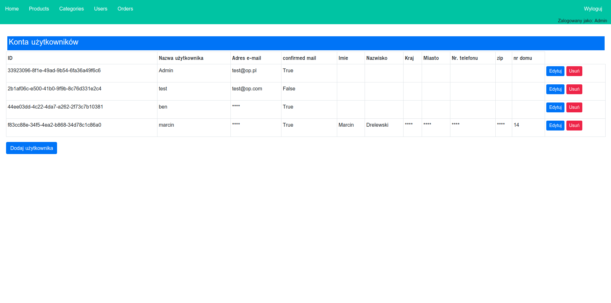
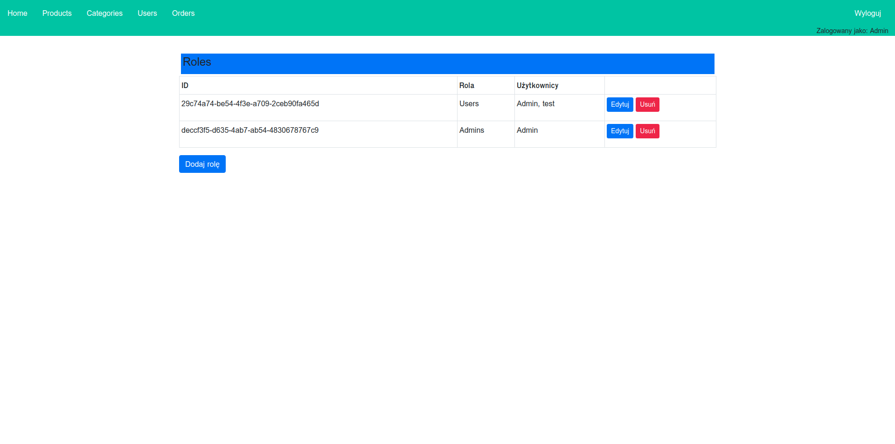
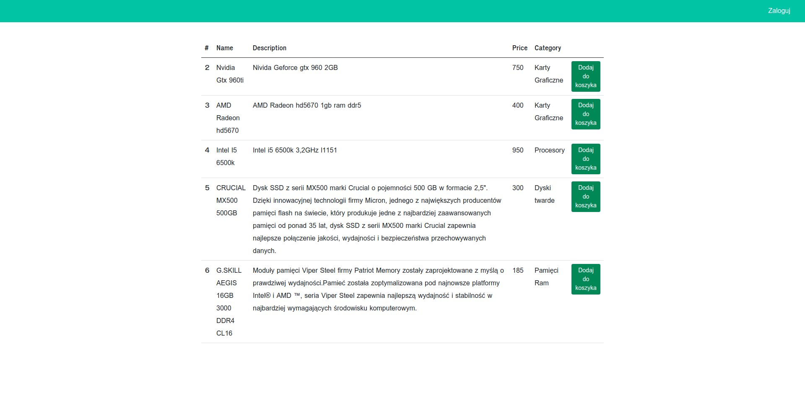
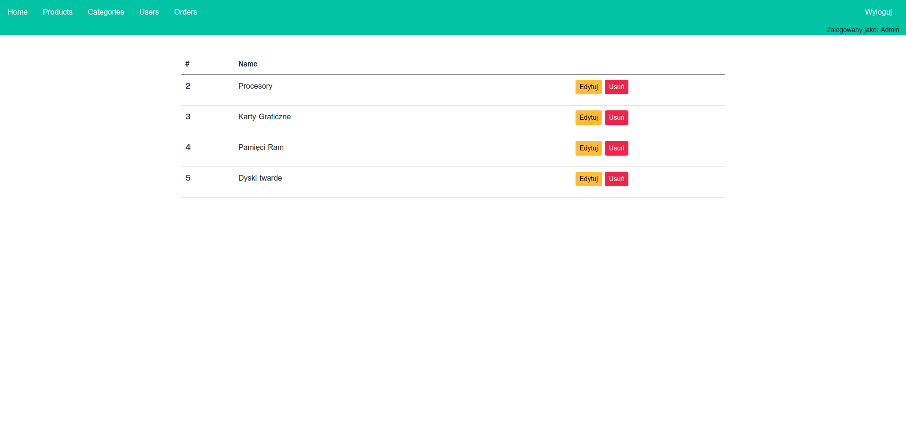
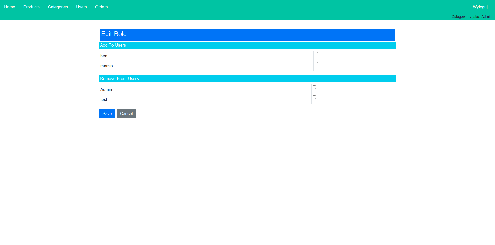
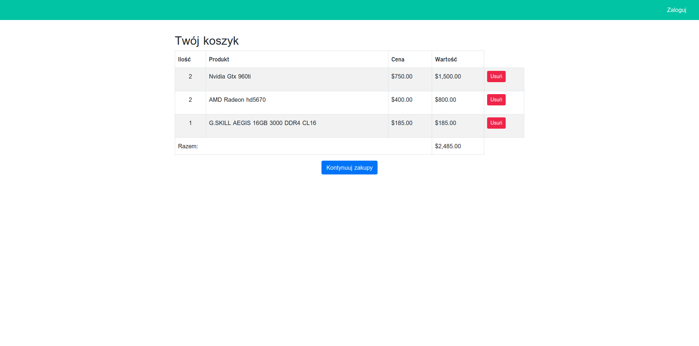
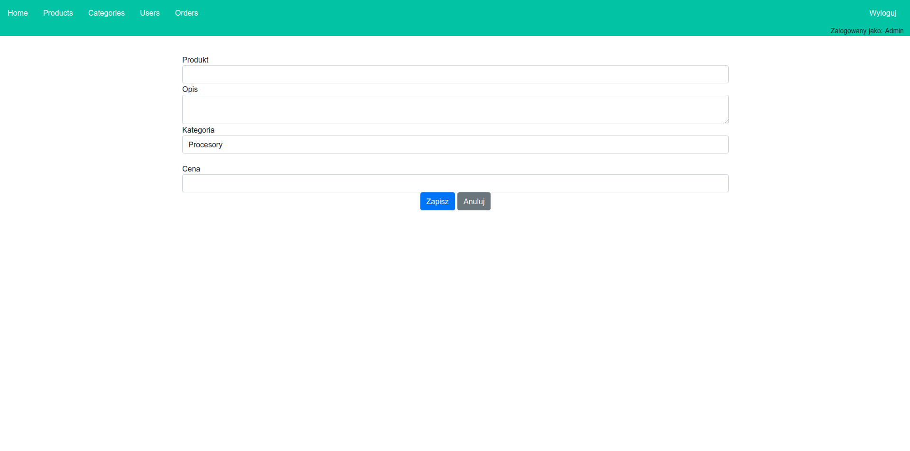

# Pc parts shop app

## Table of contents
* [General info](#general-info)
* [Technologies](#technologies)
* [Features](#features)
* [Setup](#setup)
* [Author](#author)
* [Screenshots](#screenshots)

--- 

## General info
**An ASP.NET Core application for cataloging and managing spare parts. This project provides a searchable catalog of spare parts, allowing CRUD operations and simple administrative management.**

---

## Technologies
Project is created with:
* ASP.NET Core MVC
* Entity Framework Core
* SQL Server
* Bootstrap
* Azure

---
 
## Features
- List of parts with search functionality
- Add, edit, delete items
- Simple admin panel for management

---

## Setup
To open and run this project, follow this commands:
```bash
1. git clone https://github.com/Miatosz/PartsCatalog.git
2. cd .\PartsCatalog\
3. dotnet run
```
Then you can open app in browser on port 5001(https://localhost:5001/)

...or simply click here => https://pcpartsshop.azurewebsites.net


## Author
* **[Marcin Drelewski](https://github.com/Miatosz)**
* **email:** drelewskiim@gmail.com

## Screenshots








